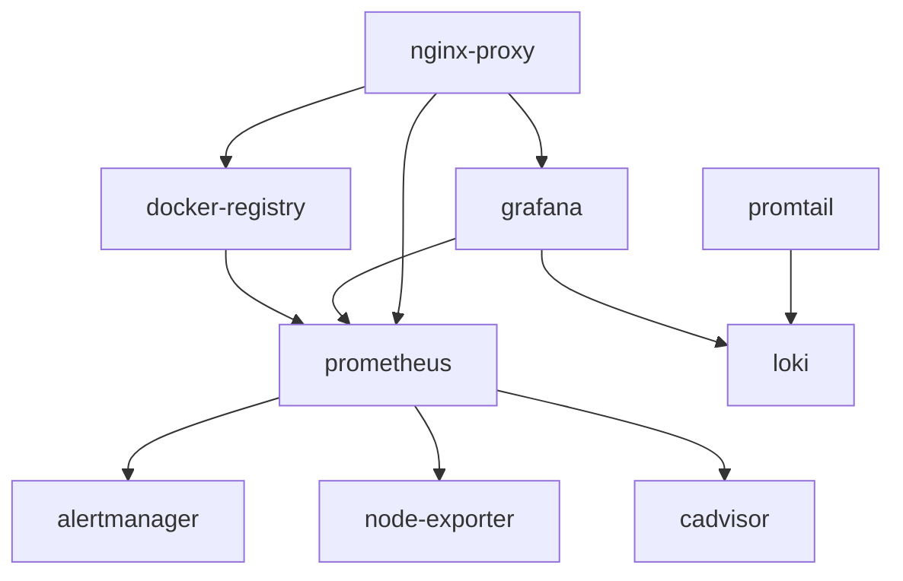

# Staging Infrastructure Services Documentation

## Server Information
- **Hostname**: staging-server
- **IP Address**: 192.168.1.14
- **OS**: Arch Linux
- **Domain**: staging.mdubiel.org
- **User**: ansible (with sudo privileges)

---

## Infrastructure Services Overview

**Total Services**: 12 containerized services (fully monitored)
**Networks**: 3 Docker networks (monitoring, projects, registry)  
**DNS**: External DNS management required - add A records to your DNS provider
**Monitoring**: Comprehensive self-aware monitoring with 12+ targets and auto-discovery

---

## Infrastructure Services

### 1. Nginx Reverse Proxy
- **Purpose**: Acts as reverse proxy and SSL termination point for all web services
- **Container Name**: `nginx-proxy`
- **Image**: `nginx:alpine`
- **Internal Port**: 80, 443
- **External Ports**: 80, 443
- **External Access**: 
  - HTTP: `http://staging.mdubiel.org`
  - HTTPS: `https://staging.mdubiel.org` (after SSL setup)
- **Configuration**: `/opt/shared/nginx/config/default.conf`
- **SSL Certificates**: `/opt/shared/nginx/ssl/` (for future Let's Encrypt)
- **Networks**: monitoring, projects, registry
- **Authentication**: None (public proxy)

### 2. Docker Registry (Artifact Registry)
- **Purpose**: Private Docker image registry for storing custom application images
- **Container Name**: `docker-registry`
- **Image**: `registry:2`
- **Internal Port**: 5000
- **External Port**: 5000
- **External Access**: 
  - Direct: `http://192.168.1.14:5000`
  - Via Proxy: `http://registry.staging.mdubiel.org`
- **Username**: `registry`
- **Password**: `registry123`
- **Storage**: `/opt/shared/registry/data`
- **Configuration**: `/opt/shared/registry/config/config.yml`
- **Auth File**: `/opt/shared/registry/auth/htpasswd`
- **Image Namespace**: `mdubiel.org`

### 2.1. Docker Registry UI (Web Interface)
- **Purpose**: Web-based interface for browsing Docker registry content
- **Container Name**: `docker-registry-ui`
- **Image**: `joxit/docker-registry-ui:2.0`
- **Internal Port**: 80
- **External Port**: 8082
- **External Access**: `http://192.168.1.14:8082`22
- **Features**: Browse repositories, view tags, delete images, search functionality, content digest display, enhanced catalog browsing (up to 1000 elements)
- **Authentication**: Uses registry credentials (registry/registry123)
- **Networks**: Default bridge network

### 3. Prometheus (Metrics Collection)
- **Purpose**: Time-series database for collecting and storing metrics from all services
- **Container Name**: `prometheus`
- **Image**: `prom/prometheus:latest`
- **Internal Port**: 9090
- **External Port**: 9090
- **External Access**: 
  - Direct: `http://192.168.1.14:9090`
  - Via Proxy: `http://prometheus.staging.mdubiel.org`
- **Authentication**: None (internal tool)
- **Data Retention**: 30 days
- **Storage**: `/opt/shared/prometheus/data`
- **Configuration**: `/opt/shared/prometheus/config/prometheus.yml`
- **Networks**: monitoring
- **Scrape Targets**:
  - Self-monitoring (localhost:9090)
  - Grafana (grafana:3000)
  - Node Exporter (node-exporter:9100)
  - cAdvisor (cadvisor:8080)

### 4. Grafana (Monitoring Dashboards)
- **Purpose**: Visualization and dashboarding for metrics, logs, and system monitoring
- **Container Name**: `grafana`
- **Image**: `grafana/grafana:latest`
- **Internal Port**: 3000
- **External Port**: 3000
- **External Access**: 
  - Direct: `http://192.168.1.14:3000`
  - Via Proxy: `http://grafana.staging.mdubiel.org`
  - Monitoring alias: `http://monitoring.staging.mdubiel.org` (redirects to Grafana)
- **Username**: `admin`
- **Password**: `admin123`
- **Storage**: `/opt/shared/grafana/data`
- **Configuration**: `/opt/shared/grafana/config/grafana.ini`
- **Networks**: monitoring
- **Data Sources**: Prometheus, Loki (to be configured)

### 5. Loki (Log Aggregation)
- **Purpose**: Centralized log collection and storage system, similar to Elasticsearch but optimized for logs
- **Container Name**: `loki`
- **Image**: `grafana/loki:latest`
- **Internal Port**: 3100
- **External Port**: 3100 (internal only)
- **External Access**: Internal service only (no direct external access)
- **Authentication**: None (internal service)
- **Log Retention**: 14 days (336h)
- **Storage**: `/opt/shared/loki/data`
- **Configuration**: `/opt/shared/loki/config/loki.yml`
- **Networks**: monitoring
- **API Endpoint**: `http://loki:3100` (internal)

### 6. Promtail (Log Shipper)
- **Purpose**: Agent that ships logs from various sources to Loki
- **Container Name**: `promtail`
- **Image**: `grafana/promtail:latest`
- **Internal Port**: 9080
- **External Port**: 9080
- **External Access**: `http://192.168.1.14:9080` (internal monitoring only)
- **Authentication**: None (internal tool)
- **Configuration**: `/opt/shared/promtail/config/promtail.yml`
- **Networks**: monitoring
- **Log Sources**:
  - System logs: `/var/log/*log`
  - Container logs: `/var/lib/docker/containers/*/*log`
- **Target**: Loki (loki:3100)

### 7. AlertManager (Alert Routing)
- **Purpose**: Handles alerts sent by Prometheus, manages routing, grouping, and notifications
- **Container Name**: `alertmanager`
- **Image**: `prom/alertmanager:latest`
- **Internal Port**: 9093
- **External Port**: 9093
- **External Access**: `http://192.168.1.14:9093` (internal tool)
- **Authentication**: None (internal tool)
- **Storage**: `/opt/shared/alertmanager/data`
- **Configuration**: `/opt/shared/alertmanager/config/alertmanager.yml`
- **Networks**: monitoring
- **Webhook URL**: `http://127.0.0.1:5001/` (placeholder)

### 8. Node Exporter (System Metrics)
- **Purpose**: Exposes hardware and OS metrics for Unix systems (CPU, memory, disk, network)
- **Container Name**: `node-exporter`
- **Image**: `prom/node-exporter:latest`
- **Internal Port**: 9100
- **External Port**: 9100
- **External Access**: `http://192.168.1.14:9100/metrics` (metrics endpoint)
- **Authentication**: None (metrics endpoint)
- **Networks**: monitoring
- **Metrics Exposed**: CPU, memory, disk, network, filesystem, load average
- **Host Mounts**: 
  - `/proc` → `/host/proc:ro`
  - `/sys` → `/host/sys:ro`
  - `/` → `/host:ro`

### 9. cAdvisor (Container Metrics)
- **Purpose**: Analyzes resource usage and performance characteristics of running containers
- **Container Name**: `cadvisor`
- **Image**: `gcr.io/cadvisor/cadvisor:latest`
- **Internal Port**: 8080
- **External Port**: 8080
- **External Access**: `http://192.168.1.14:8080` (web UI available)
- **Authentication**: None (monitoring tool)
- **Networks**: monitoring
- **Metrics**: Container CPU, memory, disk, network usage
- **Host Mounts**:
  - `/` → `/rootfs:ro`
  - `/var/run` → `/var/run:rw`
  - `/sys` → `/sys:ro`
  - `/var/lib/docker/` → `/var/lib/docker:ro`

### 10. Blackbox Exporter (Health Probes)
- **Purpose**: Probes endpoints over HTTP, HTTPS, DNS, TCP and ICMP for availability monitoring
- **Container Name**: `blackbox-exporter`
- **Image**: `prom/blackbox-exporter:latest`
- **Internal Port**: 9115
- **External Port**: 9115
- **External Access**: `http://192.168.1.14:9115` (probe results)
- **Authentication**: None (monitoring tool)
- **Networks**: monitoring
- **Configuration**: `/opt/shared/blackbox/config/blackbox.yml`
- **Probe Types**: HTTP/HTTPS health checks, DNS resolution, TCP connectivity
- **Monitored Targets**: All service domains and direct IP endpoints

### 11. Nginx Prometheus Exporter (Reverse Proxy Metrics)
- **Purpose**: Exports nginx metrics from stub_status module for monitoring proxy performance
- **Container Name**: `nginx-prometheus-exporter`
- **Image**: `nginx/nginx-prometheus-exporter:latest`
- **Internal Port**: 9113
- **External Port**: 9113
- **External Access**: `http://192.168.1.14:9113/metrics` (nginx metrics)
- **Authentication**: None (monitoring tool)
- **Networks**: monitoring
- **Source**: nginx-proxy:8080/nginx_status
- **Metrics**: Requests per second, connections, response codes, upstream health

---

## Network Architecture

### Docker Networks
1. **monitoring**: Core monitoring services communication
   - prometheus, grafana, loki, alertmanager, node-exporter, cadvisor, promtail, docker-registry
2. **projects**: Application containers and reverse proxy
   - nginx-proxy, future application containers  
3. **registry**: Docker registry and monitoring integration
   - docker-registry, nginx-proxy

### Port Mapping Summary
| Service | Internal | External | Protocol | Public | Monitored |
|---------|----------|----------|----------|---------|-----------|
| nginx-proxy | 80,443,8080 | 80,443,8080 | HTTP/HTTPS | ✅ | ✅ |
| docker-registry | 5000 | 5000 | HTTP | ✅ | ✅ |
| prometheus | 9090 | 9090 | HTTP | ✅ | ✅ |
| grafana | 3000 | 3000 | HTTP | ✅ | ✅ |
| loki | 3100 | 3100 | HTTP | ❌ | ✅ |
| alertmanager | 9093 | 9093 | HTTP | ❌ | ✅ |
| node-exporter | 9100 | 9100 | HTTP | ❌ | ✅ |
| cadvisor | 8080 | 8080 | HTTP | ❌ | ✅ |
| promtail | 9080 | 9080 | HTTP | ❌ | ✅ |
| blackbox-exporter | 9115 | 9115 | HTTP | ❌ | ✅ |
| nginx-prometheus-exporter | 9113 | 9113 | HTTP | ❌ | ✅ |

---

## DNS Configuration Required

**Important**: You need to manage DNS externally since all services run on a single IP address.

Add these A records to your DNS provider (e.g., Cloudflare, Route53, etc.):

```dns
# Main domain
staging.mdubiel.org                 A    192.168.1.14

# Service subdomains  
grafana.staging.mdubiel.org         A    192.168.1.14
prometheus.staging.mdubiel.org      A    192.168.1.14
registry.staging.mdubiel.org        A    192.168.1.14
monitoring.staging.mdubiel.org      A    192.168.1.14
beryl3.staging.mdubiel.org          A    192.168.1.14
```

**Note**: DNS delegation to a local DNS server is not possible without a separate public IP address for the DNS service.

---

## Authentication Summary

| Service | Username | Password | Type | Notes |
|---------|----------|----------|------|-------|
| Docker Registry | `registry` | `registry123` | HTTP Basic | bcrypt hashed |
| Grafana | `admin` | `admin123` | Web Form | Change on first login |
| System SSH | `ansible` | SSH Key | Key-based | Passwordless sudo |

---

## Data Persistence

All service data is stored in `/opt/shared/` with proper ownership:

```
/opt/shared/
├── nginx/
│   ├── config/default.conf          # Nginx virtual hosts
│   └── ssl/                         # SSL certificates (future)
├── registry/
│   ├── data/                        # Docker registry storage
│   ├── config/config.yml           # Registry configuration
│   └── auth/htpasswd              # Authentication file
├── prometheus/
│   ├── data/                        # Metrics database
│   └── config/prometheus.yml       # Scrape configuration
├── grafana/
│   ├── data/                        # Dashboards, users, etc.
│   └── config/grafana.ini          # Main configuration
├── loki/
│   ├── data/                        # Log storage
│   └── config/loki.yml             # Loki configuration
├── alertmanager/
│   ├── data/                        # Alert state
│   └── config/alertmanager.yml     # Routing rules
└── promtail/
    └── config/promtail.yml         # Log shipping config
```

---

## Service Dependencies



**Startup Order**:
1. Networks (monitoring, projects, registry)
2. nginx-proxy (reverse proxy)
3. docker-registry (artifact storage)
4. prometheus (metrics collection)
5. grafana (visualization)
6. loki (log storage)
7. alertmanager (alert routing)
8. node-exporter (system metrics)
9. cadvisor (container metrics)
10. promtail (log shipping)

---

## Security Considerations

### Container Security
- All containers run as non-root users where possible
- Proper file permissions on mounted volumes
- Network segmentation via Docker networks
- No privileged containers except where required (node-exporter, cadvisor)

### Authentication
- Docker Registry: HTTP Basic Auth with bcrypt password hashing
- Grafana: Admin user with configurable password
- Internal services: No authentication (network-isolated)

### Network Security
- Services exposed only on necessary interfaces
- Internal-only services not accessible externally
- Reverse proxy handles all external SSL termination (future)

---

## Comprehensive Monitoring & Observability

### 🎯 Self-Aware Monitoring
The infrastructure is **fully self-aware** with comprehensive monitoring of all components:

**Monitoring Targets (11 services)**:
1. **prometheus** - Self-monitoring with metrics storage
2. **alertmanager** - Alert routing and management
3. **grafana** - Dashboard and visualization metrics  
4. **docker-registry** - Artifact storage metrics
5. **nginx-proxy** - Reverse proxy performance (via nginx-exporter)
6. **node-exporter** - Host system metrics (CPU, memory, disk, network)
7. **cadvisor** - All container resource usage and performance
8. **loki** - Log storage system metrics
9. **promtail** - Log shipping pipeline metrics
10. **blackbox-exporter** - Health probe results and availability
11. **nginx-prometheus-exporter** - Detailed nginx performance metrics

### 📊 Metrics Collection Strategy

**Infrastructure Tier**:
- **System Metrics**: CPU, memory, disk, network, load average
- **Container Metrics**: Per-container resource usage, limits, restarts
- **Network Metrics**: Inter-service communication, proxy performance
- **Storage Metrics**: Disk usage, I/O performance, retention

**Application Tier**:
- **Service Metrics**: Request rates, response times, error rates
- **Business Metrics**: Registry uploads/downloads, dashboard views
- **Security Metrics**: Authentication attempts, failed requests

**External Health Monitoring**:
- **Domain Availability**: HTTP health checks for all *.staging.mdubiel.org
- **Service Endpoints**: Direct IP health checks (192.168.1.14:*)
- **Response Times**: End-to-end latency monitoring
- **SSL Certificate**: Certificate expiry tracking (future)

### 📋 Log Aggregation Pipeline
- **System Logs**: `/var/log/*` → promtail → loki
- **Container Logs**: `/var/lib/docker/containers/*/*log` → promtail → loki  
- **Application Logs**: Custom application logs → promtail → loki
- **Access Logs**: Nginx access logs → promtail → loki
- **Log Retention**: 14 days (336h) with automatic cleanup

### 🚨 Alerting & Notification Pipeline
1. **Metric Thresholds**: Prometheus evaluates alerting rules
2. **Alert Routing**: AlertManager groups, routes, and deduplicates alerts
3. **Notification Channels**: 
   - Email notifications (configurable)
   - Webhook integrations (Slack, Discord, PagerDuty)
   - Custom notification handlers

### 🔍 Service Discovery & Auto-Monitoring
**Docker Service Discovery**:
- Automatic container detection via Docker socket
- Label-based inclusion: `prometheus.scrape=true`
- Dynamic target registration for new containers
- Automatic removal of stopped containers

**Container Labels Used**:
```yaml
prometheus.scrape: "true/false"    # Include in monitoring
service.name: "service-name"       # Service identification  
service.component: "component"     # Component classification
```

### 📈 Available Dashboards & Metrics

**Prometheus Targets** (http://192.168.1.14:9090/targets):
- All 11 services with UP/DOWN status
- Scrape duration and last scrape time
- Target health and error details

**Grafana Dashboards** (http://192.168.1.14:3000):
- **Infrastructure Overview**: System resource usage
- **Container Monitoring**: Per-container metrics via cAdvisor
- **Service Health**: Availability and response times
- **Nginx Performance**: Request rates, upstream health
- **Log Analysis**: Log volume and error tracking
- **Alert Status**: Current alerts and alert history

**Key Metrics Available**:
```promql
# System metrics
node_cpu_seconds_total
node_memory_MemAvailable_bytes  
node_filesystem_size_bytes

# Container metrics  
container_cpu_usage_seconds_total
container_memory_usage_bytes
container_network_receive_bytes_total

# Service metrics
prometheus_tsdb_head_samples_appended_total
grafana_http_request_duration_seconds
nginx_http_requests_total

# Health check metrics
probe_success
probe_duration_seconds
```

### ⚡ Advanced Features

**Real-time Monitoring**:
- 15-second scrape intervals for critical metrics
- 30-second intervals for application metrics  
- Immediate alert evaluation (15s evaluation interval)

**Historical Data**:
- 30-day metric retention in Prometheus TSDB
- 14-day log retention in Loki
- Configurable retention policies per metric type

**Performance Optimization**:
- Efficient metric cardinality management
- Optimized query performance with recording rules
- Resource usage monitoring of monitoring stack itself

**Security & Access**:
- Internal network isolation for monitoring traffic
- No external access to sensitive monitoring endpoints
- Secure metric collection without authentication bypass

---

## Backup Strategy

### Critical Data
- **Docker Registry**: `/opt/shared/registry/data` (container images)
- **Prometheus**: `/opt/shared/prometheus/data` (metrics history)
- **Grafana**: `/opt/shared/grafana/data` (dashboards, users)
- **Configurations**: All `/opt/shared/*/config/` directories

### Backup Commands
```bash
# Create backup
sudo tar -czf /opt/backups/infrastructure-$(date +%Y%m%d).tar.gz /opt/shared/

# Restore backup
sudo tar -xzf /opt/backups/infrastructure-YYYYMMDD.tar.gz -C /
```

---

## Maintenance Commands

### Health Check
```bash
# Check all container status
ansible staging -m shell -a "docker ps" -u ansible

# Check specific service logs
ansible staging -m shell -a "docker logs <service-name> --tail=20" -u ansible
```

### Service Restart
```bash
# Restart specific service
ansible staging -m shell -a "docker restart <service-name>" -u ansible

# Restart all infrastructure
ansible-playbook -i inventory/staging.yml playbooks/infra.yml
```

### Clean Deployment
```bash
# Full cleanup and redeploy
ansible-playbook -i inventory/staging.yml playbooks/cleanup.yml
ansible-playbook -i inventory/staging.yml playbooks/infra.yml
```